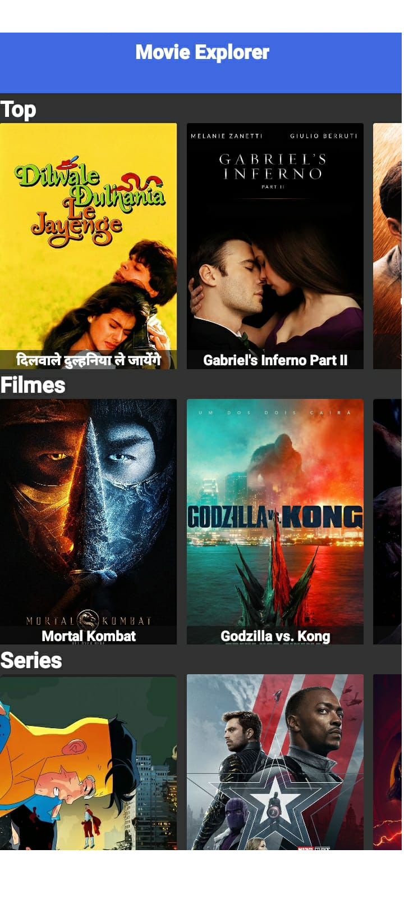
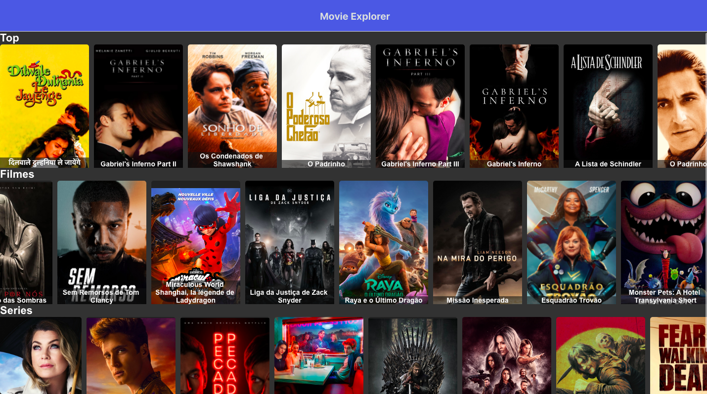

## React-flix 
This project was built was developed in __[React Native](https://reactnative.dev/)__, using __[TheMovieDataBaseApi](https://developers.themoviedb.org/3)__. I'm using __[Expo-Cli](https://expo.io/)__ to generate a compilation for the Web that is online as __[Movie Explorer](http://moviex.surge.sh)__.

In the image below is the example of the Mobile version of the system.

    
    
    

In the image below is the example of the Web version of the system.

